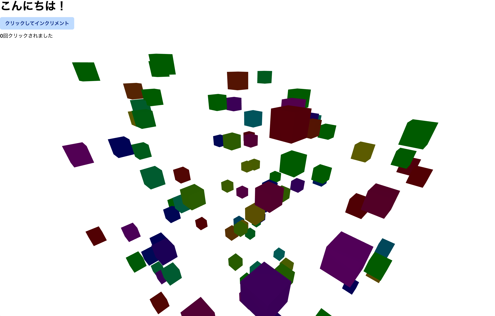

# Three.js を使用した React フレームワークのベンチマーク
Three.js を使用した Astro (React,SSG) , Vite (React,SSG) , Next.js (React,SSR) のベンチマークを行った結果をまとめました。

ローカルでサーバーを立ち上げ、 Playwright でベンチマークを行いました。

## 結論
- ロード時間は Astro が最も短い
- メモリ使用量は Astro と Vite と Next.js ともに同様
- ブロッキング時間は Astro が最も短い
- バンドルサイズは Astro と Vite が同じで、 Next.js が一番大きい
- インタラクティブ性は Vite が最も良い
- パフォーマンスは Astro が最も良い

## 実行環境
| | |
| --- | --- |
| OS | macOS 15.4 (darwin 24.4.0) |
| ハードウェア | MacBook Pro (Model: Mac14,6) |
| チップ | Apple M2 Max |
| CPU コア数 | 12 (8 performance and 4 efficiency) |
| アーキテクチャ | arm64 |
| メモリ | 64GB |
| Node.js バージョン | v22.14.0 |
| Playwright バージョン | 1.51.1 |

## ベンチマーク対象のWebページ
以下コンポーネントが配置されているWebページ (Tailwind CSS でスタイリング)
- useState を利用したカウンターのReactコンポーネント
- Three.js (react-three-fiber) を利用したReactコンポーネント

その他のページの実装はしていません。（フレームワークがデフォルトで生成する404ページを除く）

## ベンチマーク結果 (10回測定時の平均)
| 指標 | Astro | Vite | Next.js |
| --- | --- | --- | --- |
| ロード時間 [ms] | 721 | 980 | 934 |
| メモリ使用量 [KB] | 14844 | 14844 | 14756 |
| First Contentful Paint [ms] | 42 | 59 | 51 |
| Largest Contentful Paint [ms] | 42 | 59 | 51 |
| Time to Interactive [ms] | 15.5 | 8.2 | 22 |
| Total Blocking Time [ms] | 711.6 | 979.4 | 917.8 |
| バンドル合計サイズ [KB] | 2708.29 | 2711.45 | 3281.36 |
| Gzip合計サイズ [KB] | 819.22 | 818.18 | 977.76 |
| JS バンドルサイズ [KB] | 2701.85 | 2704.9 | 3274.97 |
| CSS バンドルサイズ [KB] | 6.44 | 6.55 | 6.39 |
| JS Gzipサイズ [KB] | 817.16 | 816.11 | 975.69 |
| CSS Gzipサイズ [KB] | 2.06 | 2.07 | 2.07 |

## ベンチマーク結果の考察
### パフォーマンス指標の分析
#### 初期表示速度
Astroが最も優れたパフォーマンスを示しています。First Contentful Paint（FCP）とLargest Contentful Paint（LCP）の両方で42msという最速の値を記録しており、Next.js（51ms）やVite（59ms）と比較して明らかに優位です。これはAstroのアイランドアーキテクチャによる部分的なハイドレーションの恩恵と考えられます。

#### インタラクティブ性
Time to Interactive（TTI）においては、Viteが8.2msと最も優れた結果を示しています。これはViteの開発に最適化されたESMベースのビルドシステムが本番環境でも効果を発揮していると考えられます。一方、Next.jsは22msと最も遅く、SSRによるオーバーヘッドの影響が見られます。

#### ブロッキング時間
Total Blocking Time（TBT）では、Astroが711.6msと最も良い結果を示しています。これはメインスレッドのブロッキングが少なく、ユーザー操作に対する応答性が高いことを意味します。ViteとNext.jsはそれぞれ979.4ms、917.8msと比較的高い値を示しており、JavaScript実行によるブロッキングが多いことが分かります。

#### バンドルサイズ
バンドルサイズに関しては、AstroとViteが同程度（約2.7MB）であるのに対し、Next.jsは約3.3MBと明らかに大きくなっています。Gzip圧縮後も同様の傾向が見られ、Next.jsは約978KBと他の2つのフレームワーク（約818KB）より約20%大きくなっています。これはNext.jsのランタイムやSSR関連のコードが追加されているためと考えられます。

### フレームワーク別の特徴
#### Astro (React,SSG)
- 初期表示速度が最も速い（FCP・LCP: 42ms）
- ブロッキング時間が最小（TBT: 711.6ms）
- ロード時間が最短（721ms）
- バンドルサイズが小さい（2708.29KB、Gzip: 819.22KB）

#### Vite (React,SSG)
- インタラクティブ性に最も優れている（TTI: 8.2ms）
- バンドルサイズはAstroと同等（2711.45KB、Gzip: 818.18KB）
- FCPとLCPは59msで3つの中では最も遅い
- ブロッキング時間が最も長い（TBT: 979.4ms）

#### Next.js (React,SSR)
- バンドルサイズが最も大きい（3281.36KB、Gzip: 977.76KB）
- FCPとLCPは51msで中間の値
- インタラクティブ性は最も低い（TTI: 22ms）
- メモリ使用量は僅差だが最も少ない（14756KB）

Three.jsのような重いライブラリを使用する場合、Astroの部分的ハイドレーションアプローチが最もバランスが良いと言えますが、アプリケーションの要件によって最適な選択は変わります。
